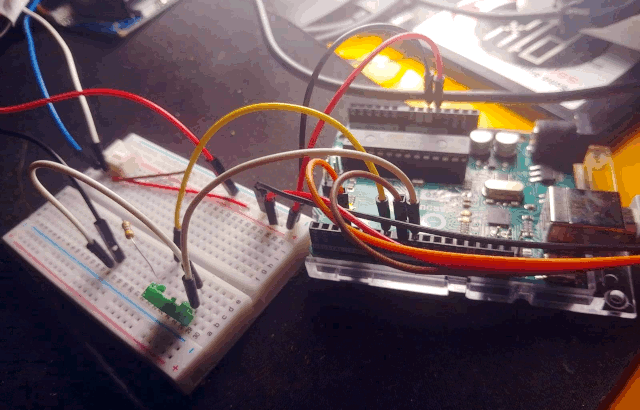
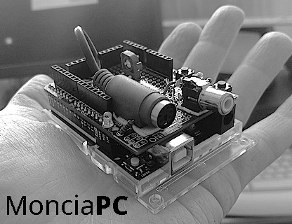
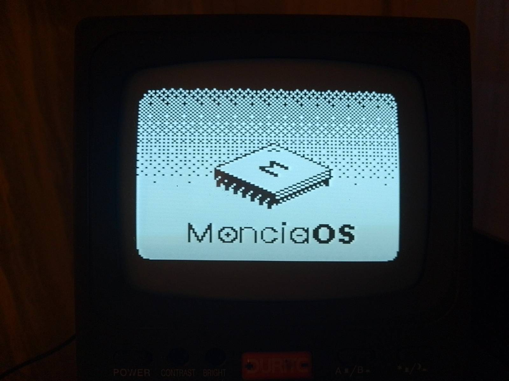
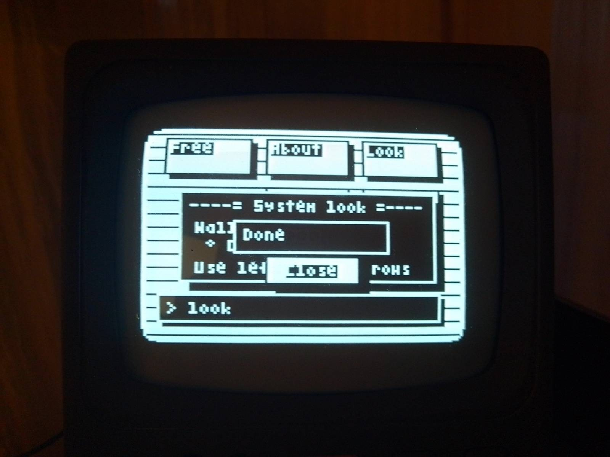
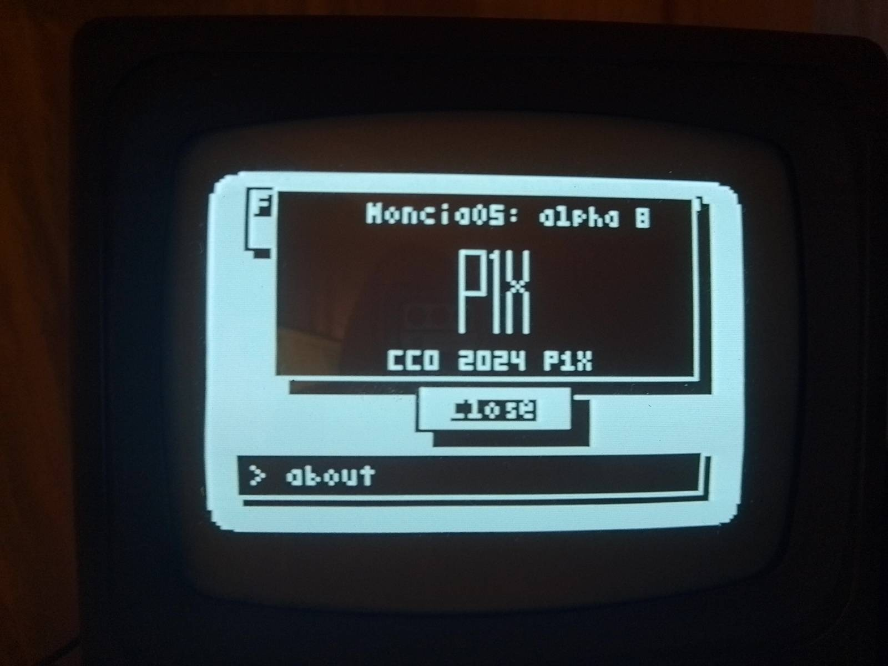

# Moncia a Homebrew Personal Computer

> This is my computer. There are many like it, but this one is mine.
> My computer is my best friend. It is my life. I must master it as I must master my life. 

Based on 8-bit microcontroller (Arduino Uno) and home made operatin system (MonciaOS) makes this dream personal computer.

It has input from a regular PS/2 keyboard and can output to the black &white TV. User interface is handled by graphical OS.

Read more at [smol.p1x.in/moncia-pc/](https://smol.p1x.in/moncia-pc/).

## Personal Computer
### Breadboard Edition

### Arduino Hat

## Operating System

